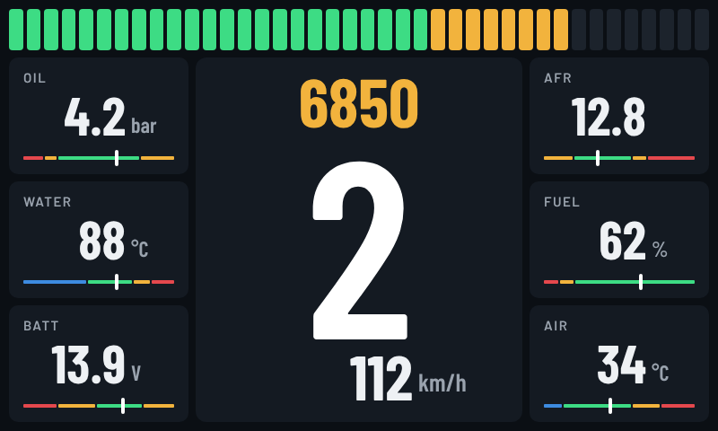

# ESP32 + Nextion + Speeduino Race Dash

A digital race dash for a car running a [Speeduino](https://speeduino.com/) ECU.
An ESP32 reads live data from Speeduino over Bluetooth and drives a Nextion 7" (800×480) display,
with a 40-segment RPM bar, flashing shift light, big gear indicator, six warning tiles and four touch settings pages.



## Hardware

- **Nextion NX8048T070** (7", 800×480, Basic series)
- **ESP32 Dev Module / ESP32-WROOM-32**: a classic ESP32. Not S2/S3/C3 (no Bluetooth Classic), and not WROVER (GPIO16/17 taken by PSRAM).
- **Speeduino** with an **HC-05/HC-06** Bluetooth-serial module (115200 baud)
- **Fuel sender** (300 Ω empty / 35 Ω full) + 150 Ω resistor + 1 µF capacitor
- A **solid 5 V supply**, plus 470–1000 µF + 100 nF at the ESP32. Bluetooth current spikes cause brown-outs on weak supplies.

## Wiring

```
Nextion TX (blue)   -> ESP32 GPIO4  (RX)
Nextion RX (yellow) <- ESP32 GPIO5  (TX)
Nextion 5V          -> its own 5 V supply (1 A+)
GND                 -> common for everything

Fuel sender:  3.3V --[150 ohm]--+--[sender]-- GND
                                |
                             GPIO34   (+ 1 uF to GND)

Speeduino:    HC-05 on Speeduino's serial port, ESP32 connects to it as Bluetooth master
```

## Repository layout

| Path | What |
|---|---|
| `esp32_speeduino_nextion_dash.ino` | The firmware that goes in the car |
| `nextion/images/` | All 36 pictures for the Nextion Editor, numbered in import order |
| `nextion/fonts/` | Barlow / Barlow Condensed TTFs for the Font Generator (OFL licence) |
| `nextion/BUILD_IN_NEXTION_EDITOR.md` | Dash page (page 0): every component, position and event |
| `nextion/BUILD_SETTINGS_PAGES.md` | Settings pages 1–4: every component, position and event |
| `nextion/previews/` | Previews of every page and component maps (x, y, w, h) |
| `extras/esp32_dash_demo/` | Demo/test sketch: sweeps every element with fake data, no Speeduino needed |
| `extras/nextion_link_check/` | Checks ESP32 ↔ Nextion wiring and baud rate |

## Flashing the ESP32

Arduino IDE settings:

| Setting | Value |
|---|---|
| Board | **ESP32 Dev Module** |
| Partition Scheme | **Huge APP (3MB No OTA)** (the sketch is about 1.6 MB, which doesn't fit the default) |
| Upload Speed | **115200** (921600 drops out on many cables) |

Unplug the Nextion while uploading, and hold **BOOT** during `Connecting…` if needed.

All user settings are in the **CONFIG** section at the top of the sketch: the HC-05 MAC address, Speeduino data offsets, fuel sender, gearbox ratios and picture IDs.

## Building the Nextion HMI

Follow `nextion/BUILD_IN_NEXTION_EDITOR.md`, then `nextion/BUILD_SETTINGS_PAGES.md`.
Import the pictures **in file-name order**: the firmware relies on the picture numbers.
Compile, then load the `.tft` from a FAT32 microSD card.

## Pages

| Page | Content |
|---|---|
| 0 Dash | RPM bar + shift light, RPM, gear, speed, oil, water, battery, AFR, fuel, air |
| 1 Display | Brightness slider, units (°C/°F, bar/psi, km/h/mph) |
| 2 Shift light | Bar start / full RPM, shift light on / off RPM (hysteresis), flash speed |
| 3 Warnings | Limits that turn a tile red |
| 4 Peaks & status | Max RPM, top speed, max water, min oil, reset, Bluetooth link status |

**Hold the gear number for 1.5 s** to open settings. **‹ DASH** returns.
Settings are saved in the ESP32's flash when you return to the dash.

## How it works

- **Speeduino link:** legacy `'A'` command at 10 Hz, with a quiet-flush before each request so late bytes never misalign the data. Bluetooth runs in its own FreeRTOS task on core 0, so the display never waits for it.
- **Display:** only changed values are sent. Commands go into a 2 KB UART buffer, so the main loop never blocks. If no data arrives for 0.6 s, every value shows `--`.
- **Shift light:** the whole RPM bar flashes red/dark, driven by a Nextion timer, so flashing doesn't depend on Bluetooth timing.
- **Nextion → ESP32:** 3-byte messages `23 type code` from `printh`:
  - `E`: page entered
  - `P` / `R`: button pressed / released
  - `B`: brightness

Speeduino offsets used (from `speeduino.ini`, 202501.x):

| Offset | Field |
|---|---|
| 6 | IAT (+40) |
| 7 | Coolant (+40) |
| 9 | Battery ×10 |
| 10 | AFR ×10 |
| 14–15 | RPM |
| 104–105 | VSS km/h |
| 106 | Gear |

## Serial Monitor (115200)

| Key | Action |
|---|---|
| `s` | Print decoded values, packets per second and errors |
| `d` | Raw Speeduino packet dump on/off |
| `n` | Bytes received from the Nextion on/off |
